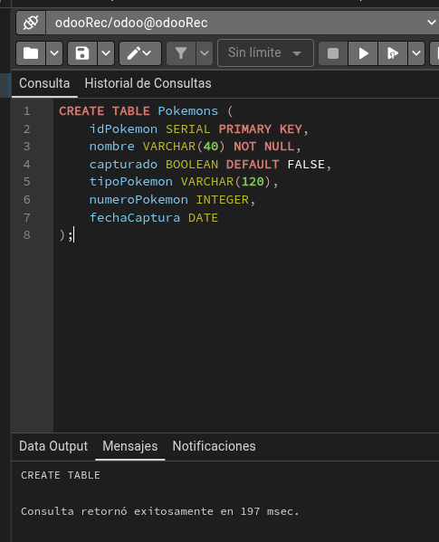

# Tarea2Recu

## Apartado 1
```bash
CREATE TABLE Pokemons (
    idPokemon SERIAL PRIMARY KEY,
    nombre VARCHAR(40) NOT NULL,
    capturado BOOLEAN DEFAULT FALSE,
    tipoPokemon VARCHAR(120),
    numeroPokemon INTEGER,
    fechaCaptura DATE
);

```


