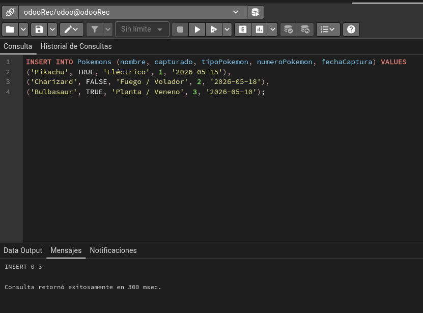
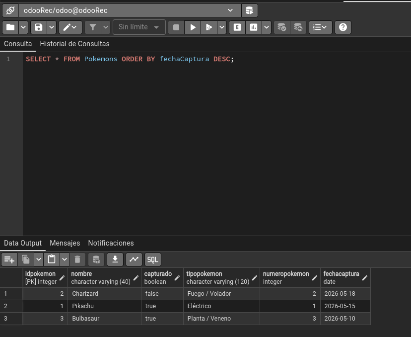
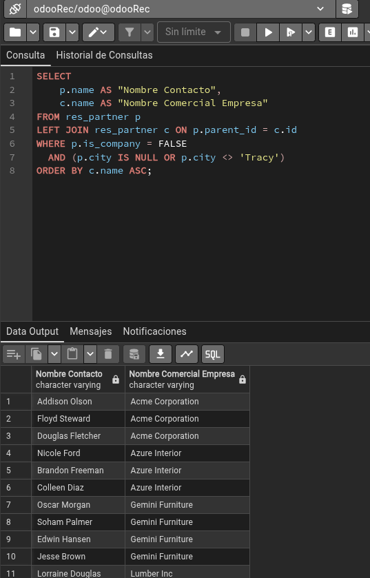
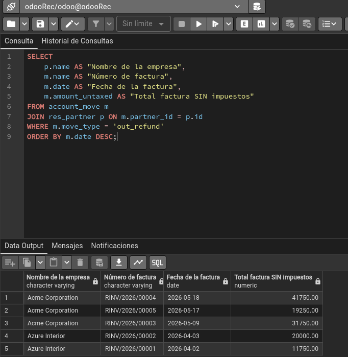
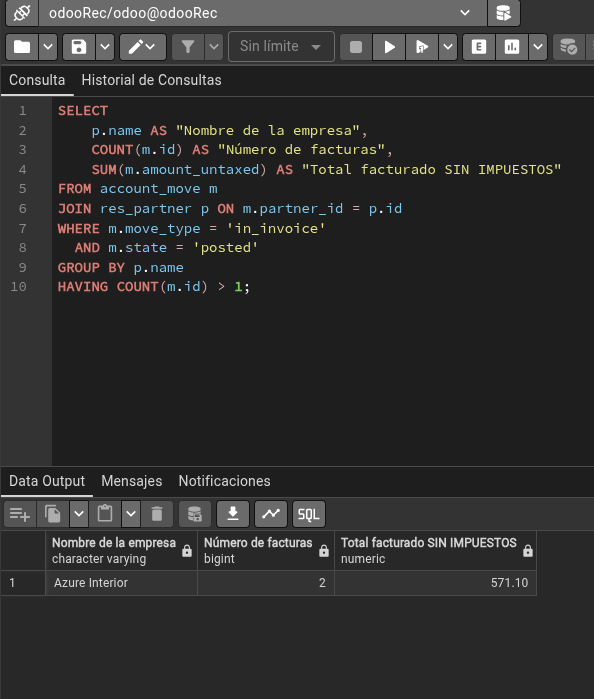

# Tarea2Recu

## Apartado 1
```bash
CREATE TABLE Pokemons (
    idPokemon SERIAL PRIMARY KEY,
    nombre VARCHAR(40) NOT NULL,
    capturado BOOLEAN DEFAULT FALSE,
    tipoPokemon VARCHAR(120),
    numeroPokemon INTEGER,
    fechaCaptura DATE
);

```


## Apartado 2
```bash
INSERT INTO Pokemons (nombre, capturado, tipoPokemon, numeroPokemon, fechaCaptura) VALUES
('Pikachu', TRUE, 'Eléctrico', 1, '2026-05-15'),
('Charizard', FALSE, 'Fuego / Volador', 2, '2026-05-18'),
('Bulbasaur', TRUE, 'Planta / Veneno', 3, '2026-05-10');

```



## Apartado 3
```bash
SELECT * FROM Pokemons ORDER BY fechaCaptura DESC;

```



## Apartado 4
```bash
SELECT 
    p.name AS "Nombre Contacto", 
    c.name AS "Nombre Comercial Empresa"
FROM res_partner p
LEFT JOIN res_partner c ON p.parent_id = c.id
WHERE p.is_company = FALSE 
  AND (p.city IS NULL OR p.city <> 'Tracy')
ORDER BY c.name ASC;

```



## Apartado 5
```bash
SELECT 
    p.name AS "Nombre de la empresa",
    m.name AS "Número de factura",
    m.date AS "Fecha de la factura",
    m.amount_untaxed AS "Total factura SIN impuestos"
FROM account_move m
JOIN res_partner p ON m.partner_id = p.id
WHERE m.move_type = 'out_refund'
ORDER BY m.date DESC;

```



## Apartado 6
```bash
SELECT 
    p.name AS "Nombre de la empresa",
    COUNT(m.id) AS "Número de facturas",
    SUM(m.amount_untaxed) AS "Total facturado SIN IMPUESTOS"
FROM account_move m
JOIN res_partner p ON m.partner_id = p.id
WHERE m.move_type = 'in_invoice' 
  AND m.state = 'posted'
GROUP BY p.name
HAVING COUNT(m.id) > 1;

```


